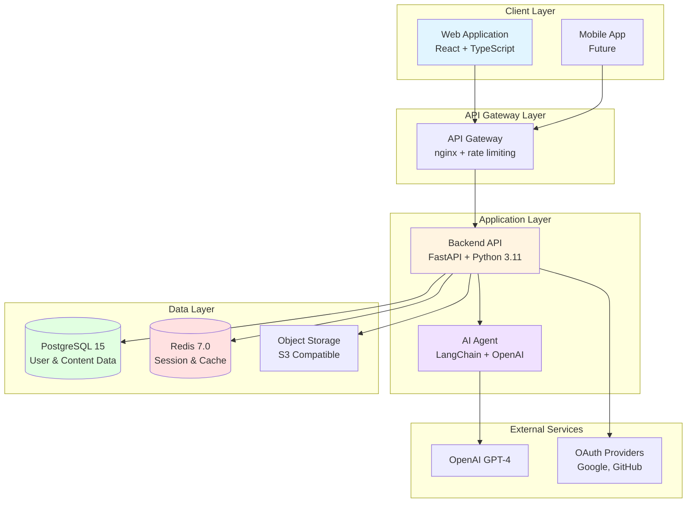
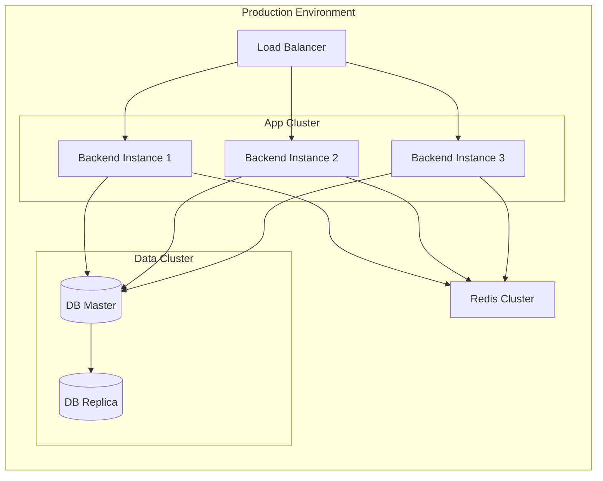
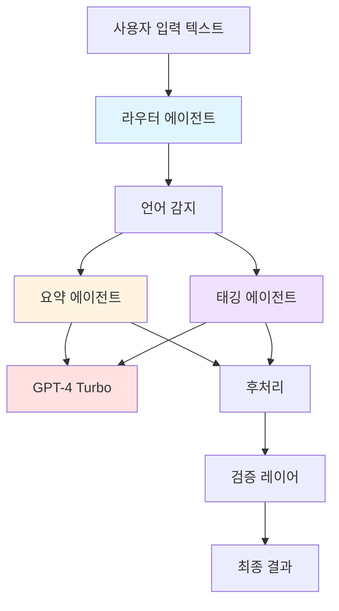
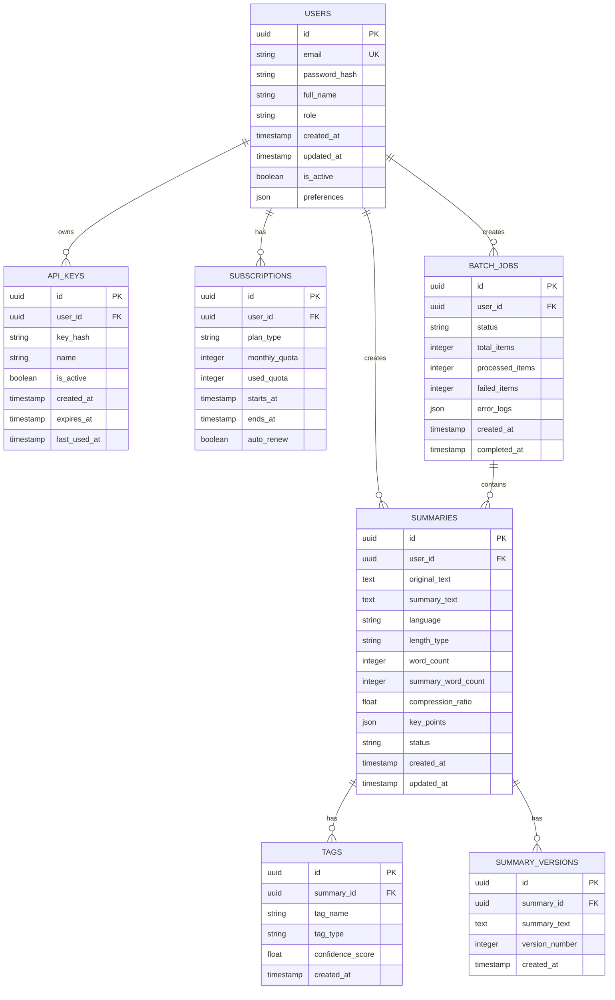

# 자동 요약/태깅 서비스 계약서

## 문서 정보
- **생성일**: 2025-10-28
- **버전**: 1.0.0
- **문서 유형**: 서비스 계약 및 기술 명세서

---

## 1. 서비스 개요

### 1.1 서비스 명칭
**AI 기반 자동 요약 및 태깅 서비스 (AutoSumTag)**

### 1.2 서비스 목적
사용자가 제공하는 텍스트 콘텐츠(문서, 기사, 블로그 포스트 등)를 자동으로 분석하여 핵심 내용을 요약하고, 적절한 태그를 자동으로 생성하여 콘텐츠 관리 및 검색 효율성을 극대화하는 서비스입니다.

### 1.3 비즈니스 목표
- 콘텐츠 처리 시간을 수동 작업 대비 **80% 이상 단축**
- 태그 정확도 **85% 이상** 달성
- 월간 활성 사용자 **10,000명** 확보 (출시 후 6개월)
- 사용자 만족도 **4.5/5.0** 이상 유지

### 1.4 타겟 사용자
- **콘텐츠 크리에이터**: 블로거, 작가, 저널리스트
- **연구자 및 학생**: 논문 요약, 학술 자료 정리
- **기업 사용자**: 문서 관리, 지식베이스 구축
- **마케터**: 콘텐츠 마케팅 자료 관리

### 1.5 핵심 기능
- **다국어 텍스트 요약**: 한국어, 영어, 일본어, 중국어 지원
- **자동 태그 생성**: 키워드 추출 및 카테고리 분류
- **요약 길이 조절**: 짧은/중간/긴 요약 옵션
- **배치 처리**: 다수의 문서 동시 처리
- **API 제공**: 외부 서비스 연동
- **요약 히스토리 관리**: 과거 요약 결과 저장 및 검색

---

## 2. 시스템 아키텍처

### 2.1 전체 아키텍처



### 2.2 컴포넌트 구성

| 컴포넌트 | 기술 스택 | 역할 |
|---------|----------|------|
| **Frontend** | React 18, TypeScript, Tailwind CSS, Vite | 사용자 인터페이스 제공 |
| **Backend API** | FastAPI 0.104, Python 3.11, SQLAlchemy 2.0 | 비즈니스 로직 및 API 제공 |
| **AI Agent** | LangChain 0.1, OpenAI GPT-4 | 텍스트 요약 및 태그 생성 |
| **Database** | PostgreSQL 15, pgvector | 데이터 저장 및 벡터 검색 |
| **Cache** | Redis 7.0 | 세션 관리 및 캐싱 |
| **Object Storage** | MinIO / AWS S3 | 파일 저장 |

### 2.3 배포 아키텍처



---

## 3. 프론트엔드 명세

### 3.1 기술 스택
- **프레임워크**: React 18.2.0
- **언어**: TypeScript 5.0
- **빌드 도구**: Vite 5.0
- **스타일링**: Tailwind CSS 3.4
- **상태 관리**: Zustand 4.4
- **라우팅**: React Router 6.20
- **HTTP 클라이언트**: Axios 1.6
- **폼 관리**: React Hook Form 7.48
- **UI 컴포넌트**: Radix UI, shadcn/ui

### 3.2 페이지 구조

```
/                          # 홈페이지 (랜딩)
/login                     # 로그인
/signup                    # 회원가입
/dashboard                 # 대시보드 (요약 히스토리)
/summarize                 # 텍스트 입력 및 요약
/summarize/new             # 새 요약 생성
/summarize/:id             # 요약 결과 상세
/batch                     # 배치 처리
/history                   # 히스토리 목록
/settings                  # 설정
/settings/profile          # 프로필 설정
/settings/api              # API 키 관리
/settings/billing          # 결제 관리
/docs                      # API 문서
```

### 3.3 주요 컴포넌트 구조

```typescript
src/
├── components/
│   ├── common/
│   │   ├── Header.tsx
│   │   ├── Footer.tsx
│   │   ├── Sidebar.tsx
│   │   └── LoadingSpinner.tsx
│   ├── summarize/
│   │   ├── TextInput.tsx
│   │   ├── SummaryOptions.tsx
│   │   ├── SummaryResult.tsx
│   │   └── TagList.tsx
│   ├── history/
│   │   ├── HistoryList.tsx
│   │   ├── HistoryItem.tsx
│   │   └── HistoryFilter.tsx
│   └── batch/
│       ├── FileUpload.tsx
│       ├── BatchProgress.tsx
│       └── BatchResults.tsx
├── pages/
│   ├── HomePage.tsx
│   ├── DashboardPage.tsx
│   ├── SummarizePage.tsx
│   └── SettingsPage.tsx
├── stores/
│   ├── authStore.ts
│   ├── summaryStore.ts
│   └── uiStore.ts
├── api/
│   ├── client.ts
│   ├── auth.ts
│   ├── summary.ts
│   └── user.ts
├── types/
│   └── index.ts
└── utils/
    ├── formatters.ts
    └── validators.ts
```

### 3.4 상태 관리 설계

```typescript
// authStore.ts
interface AuthState {
  user: User | null;
  token: string | null;
  isAuthenticated: boolean;
  login: (email: string, password: string) => Promise<void>;
  logout: () => void;
  refreshToken: () => Promise<void>;
}

// summaryStore.ts
interface SummaryState {
  summaries: Summary[];
  currentSummary: Summary | null;
  isLoading: boolean;
  error: string | null;
  createSummary: (params: CreateSummaryParams) => Promise<Summary>;
  getSummary: (id: string) => Promise<Summary>;
  deleteSummary: (id: string) => Promise<void>;
}
```

### 3.5 API 연동 패턴

```typescript
// api/client.ts
import axios from 'axios';

const apiClient = axios.create({
  baseURL: import.meta.env.VITE_API_BASE_URL,
  timeout: 30000,
  headers: {
    'Content-Type': 'application/json',
  },
});

// Request interceptor
apiClient.interceptors.request.use(
  (config) => {
    const token = localStorage.getItem('token');
    if (token) {
      config.headers.Authorization = `Bearer ${token}`;
    }
    return config;
  },
  (error) => Promise.reject(error)
);

// Response interceptor
apiClient.interceptors.response.use(
  (response) => response,
  async (error) => {
    if (error.response?.status === 401) {
      // Handle token refresh
    }
    return Promise.reject(error);
  }
);
```

---

## 4. 백엔드 명세

### 4.1 기술 스택
- **프레임워크**: FastAPI 0.104.1
- **언어**: Python 3.11
- **ORM**: SQLAlchemy 2.0.23
- **마이그레이션**: Alembic 1.12
- **인증**: python-jose[cryptography], passlib
- **비동기**: asyncio, asyncpg
- **작업 큐**: Celery 5.3 + Redis
- **검증**: Pydantic 2.5
- **테스트**: pytest 7.4, pytest-asyncio

### 4.2 프로젝트 구조

```
backend/
├── app/
│   ├── __init__.py
│   ├── main.py                 # FastAPI 앱 초기화
│   ├── config.py               # 설정 관리
│   ├── dependencies.py         # 의존성 주입
│   ├── api/
│   │   ├── __init__.py
│   │   ├── v1/
│   │   │   ├── __init__.py
│   │   │   ├── auth.py         # 인증 엔드포인트
│   │   │   ├── users.py        # 사용자 관리
│   │   │   ├── summaries.py    # 요약 API
│   │   │   ├── tags.py         # 태그 API
│   │   │   └── batch.py        # 배치 처리
│   ├── models/
│   │   ├── __init__.py
│   │   ├── user.py
│   │   ├── summary.py
│   │   ├── tag.py
│   │   └── batch_job.py
│   ├── schemas/
│   │   ├── __init__.py
│   │   ├── user.py
│   │   ├── summary.py
│   │   ├── tag.py
│   │   └── common.py
│   ├── services/
│   │   ├── __init__.py
│   │   ├── auth_service.py
│   │   ├── summary_service.py
│   │   ├── tag_service.py
│   │   └── ai_service.py       # AI 에이전트 연동
│   ├── agents/
│   │   ├── __init__.py
│   │   ├── summarizer.py       # 요약 에이전트
│   │   ├── tagger.py           # 태깅 에이전트
│   │   └── prompts.py          # 프롬프트 템플릿
│   ├── db/
│   │   ├── __init__.py
│   │   ├── session.py
│   │   └── base.py
│   ├── core/
│   │   ├── __init__.py
│   │   ├── security.py         # JWT, 암호화
│   │   ├── config.py
│   │   └── exceptions.py
│   └── utils/
│       ├── __init__.py
│       ├── text_processing.py
│       └── validators.py
├── alembic/
│   ├── versions/
│   └── env.py
├── tests/
│   ├── test_api/
│   ├── test_services/
│   └── test_agents/
├── requirements.txt
├── requirements-dev.txt
├── Dockerfile
└── docker-compose.yml
```

### 4.3 인증 및 권한 관리

#### 4.3.1 인증 방식
- **JWT 기반 인증**: Access Token (15분) + Refresh Token (7일)
- **OAuth 2.0**: Google, GitHub 소셜 로그인 지원
- **API Key**: 외부 API 연동용

#### 4.3.2 권한 레벨

| 역할 | 권한 | 월간 요약 제한 |
|-----|------|--------------|
| **Free** | 기본 요약, 태깅 | 50회 |
| **Pro** | 고급 요약, 배치 처리 | 500회 |
| **Enterprise** | API 액세스, 무제한 | 무제한 |

### 4.4 캐싱 전략

```python
# 캐시 레이어 설계
CACHE_STRATEGY = {
    "user_profile": {
        "ttl": 3600,  # 1시간
        "key_pattern": "user:{user_id}",
    },
    "summary_result": {
        "ttl": 86400,  # 24시간
        "key_pattern": "summary:{summary_id}",
    },
    "user_quota": {
        "ttl": 300,  # 5분
        "key_pattern": "quota:{user_id}",
    },
    "popular_tags": {
        "ttl": 3600,  # 1시간
        "key_pattern": "tags:popular",
    },
}
```

### 4.5 백그라운드 작업

```python
# Celery 작업 정의
from celery import Celery

celery = Celery('autoSumTag', broker='redis://localhost:6379/0')

@celery.task
def process_batch_summaries(batch_job_id: str):
    """배치 요약 처리"""
    pass

@celery.task
def send_summary_notification(user_id: str, summary_id: str):
    """요약 완료 알림"""
    pass

@celery.task
def cleanup_old_summaries():
    """오래된 요약 데이터 정리"""
    pass
```

---

## 5. AI 에이전트 명세

### 5.1 에이전트 아키텍처



### 5.2 요약 에이전트

#### 5.2.1 기능
- 다국어 텍스트 요약 (한국어, 영어, 일본어, 중국어)
- 요약 길이 조절 (짧음: 2-3문장, 중간: 5-7문장, 김: 10-15문장)
- 요약 스타일 선택 (추상적/추출적)

#### 5.2.2 프롬프트 템플릿

```python
# agents/prompts.py

SUMMARY_PROMPT_TEMPLATE = """
당신은 전문 텍스트 요약 전문가입니다. 주어진 텍스트를 정확하고 간결하게 요약해주세요.

요약 규칙:
1. 핵심 내용을 빠짐없이 포함
2. 원문의 맥락과 의도를 유지
3. 중복 제거 및 불필요한 부분 생략
4. 요약 길이: {length_type}
5. 언어: {language}

원문:
{text}

요약 결과를 다음 JSON 형식으로 제공해주세요:
{{
  "summary": "요약된 텍스트",
  "key_points": ["핵심 포인트 1", "핵심 포인트 2", ...],
  "word_count": 원문 단어 수,
  "summary_word_count": 요약 단어 수,
  "compression_ratio": 압축률
}}
"""

EXTRACTIVE_SUMMARY_PROMPT = """
주어진 텍스트에서 가장 중요한 문장들을 추출하여 요약을 만들어주세요.

원문:
{text}

{num_sentences}개의 문장을 선택해주세요.
"""
```

### 5.3 태깅 에이전트

#### 5.3.1 기능
- 자동 키워드 추출 (3-10개)
- 카테고리 분류
- 감정/톤 분석
- 주제 모델링

#### 5.3.2 프롬프트 템플릿

```python
TAG_GENERATION_PROMPT = """
당신은 텍스트 분석 전문가입니다. 주어진 텍스트를 분석하여 적절한 태그를 생성해주세요.

분석 항목:
1. 키워드: 3-10개의 핵심 키워드
2. 카테고리: 가장 적합한 카테고리 (최대 3개)
3. 감정: positive/neutral/negative
4. 주제: 텍스트의 주요 주제

카테고리 옵션:
{categories}

텍스트:
{text}

결과를 다음 JSON 형식으로 제공해주세요:
{{
  "keywords": ["키워드1", "키워드2", ...],
  "categories": ["카테고리1", "카테고리2"],
  "sentiment": "감정",
  "topics": ["주제1", "주제2"],
  "confidence_scores": {{
    "keywords": 0.95,
    "categories": 0.88,
    "sentiment": 0.92
  }}
}}
"""
```

### 5.4 에이전트 구현

```python
# agents/summarizer.py
from langchain.chat_models import ChatOpenAI
from langchain.prompts import ChatPromptTemplate
from langchain.output_parsers import PydanticOutputParser
from pydantic import BaseModel, Field

class SummaryOutput(BaseModel):
    summary: str = Field(description="요약된 텍스트")
    key_points: list[str] = Field(description="핵심 포인트 목록")
    word_count: int = Field(description="원문 단어 수")
    summary_word_count: int = Field(description="요약 단어 수")
    compression_ratio: float = Field(description="압축률")

class SummarizerAgent:
    def __init__(self, api_key: str, model: str = "gpt-4-turbo-preview"):
        self.llm = ChatOpenAI(
            api_key=api_key,
            model=model,
            temperature=0.3,
            max_tokens=2000,
        )
        self.output_parser = PydanticOutputParser(pydantic_object=SummaryOutput)
        
    async def summarize(
        self,
        text: str,
        length_type: str = "medium",
        language: str = "ko",
    ) -> SummaryOutput:
        """텍스트를 요약합니다."""
        
        prompt = ChatPromptTemplate.from_template(SUMMARY_PROMPT_TEMPLATE)
        chain = prompt | self.llm | self.output_parser
        
        result = await chain.ainvoke({
            "text": text,
            "length_type": length_type,
            "language": language,
        })
        
        return result
```

```python
# agents/tagger.py
class TagOutput(BaseModel):
    keywords: list[str] = Field(description="추출된 키워드")
    categories: list[str] = Field(description="분류된 카테고리")
    sentiment: str = Field(description="감정 분석 결과")
    topics: list[str] = Field(description="주요 주제")
    confidence_scores: dict[str, float] = Field(description="신뢰도 점수")

class TaggerAgent:
    def __init__(self, api_key: str, model: str = "gpt-4-turbo-preview"):
        self.llm = ChatOpenAI(
            api_key=api_key,
            model=model,
            temperature=0.2,
            max_tokens=1000,
        )
        self.output_parser = PydanticOutputParser(pydantic_object=TagOutput)
        
    async def generate_tags(
        self,
        text: str,
        categories: list[str] = None,
    ) -> TagOutput:
        """텍스트에서 태그를 생성합니다."""
        
        if categories is None:
            categories = self._get_default_categories()
            
        prompt = ChatPromptTemplate.from_template(TAG_GENERATION_PROMPT)
        chain = prompt | self.llm | self.output_parser
        
        result = await chain.ainvoke({
            "text": text,
            "categories": ", ".join(categories),
        })
        
        return result
    
    def _get_default_categories(self) -> list[str]:
        return [
            "기술", "비즈니스", "과학", "문화", "스포츠",
            "정치", "경제", "건강", "교육", "엔터테인먼트"
        ]
```

### 5.5 에이전트 통합 서비스

```python
# services/ai_service.py
class AIService:
    def __init__(self):
        self.summarizer = SummarizerAgent(api_key=settings.OPENAI_API_KEY)
        self.tagger = TaggerAgent(api_key=settings.OPENAI_API_KEY)
        
    async def process_text(
        self,
        text: str,
        options: ProcessingOptions,
    ) -> ProcessingResult:
        """텍스트를 처리하여 요약과 태그를 생성합니다."""
        
        # 병렬 처리
        summary_task = self.summarizer.summarize(
            text=text,
            length_type=options.length_type,
            language=options.language,
        )
        
        tag_task = self.tagger.generate_tags(
            text=text,
            categories=options.categories,
        )
        
        summary_result, tag_result = await asyncio.gather(
            summary_task,
            tag_task,
        )
        
        return ProcessingResult(
            summary=summary_result,
            tags=tag_result,
            processing_time=time.time() - start_time,
        )
```

---

## 6. 데이터 모델

### 6.1 ERD (Entity Relationship Diagram)



### 6.2 데이터베이스 스키마

#### 6.2.1 Users 테이블

```sql
CREATE TABLE users (
    id UUID PRIMARY KEY DEFAULT gen_random_uuid(),
    email VARCHAR(255) UNIQUE NOT NULL,
    password_hash VARCHAR(255) NOT NULL,
    full_name VARCHAR(100),
    role VARCHAR(20) DEFAULT 'free' CHECK (role IN ('free', 'pro', 'enterprise', 'admin')),
    created_at TIMESTAMP WITH TIME ZONE DEFAULT CURRENT_TIMESTAMP,
    updated_at TIMESTAMP WITH TIME ZONE DEFAULT CURRENT_TIMESTAMP,
    is_active BOOLEAN DEFAULT true,
    preferences JSONB DEFAULT '{}'::jsonb,
    CONSTRAINT email_format CHECK (email ~* '^[A-Za-z0-9._%+-]+@[A-Za-z0-9.-]+\.[A-Za-z]{2,}$')
);

CREATE INDEX idx_users_email ON users(email);
CREATE INDEX idx_users_role ON users(role);
CREATE INDEX idx_users_created_at ON users(created_at DESC);
```

#### 6.2.2 Summaries 테이블

```sql
CREATE TABLE summaries (
    id UUID PRIMARY KEY DEFAULT gen_random_uuid(),
    user_id UUID NOT NULL REFERENCES users(id) ON DELETE CASCADE,
    original_text TEXT NOT NULL,
    summary_text TEXT,
    language VARCHAR(10) DEFAULT 'ko' CHECK (language IN ('ko', 'en', 'ja', 'zh')),
    length_type VARCHAR(20) DEFAULT 'medium' CHECK (length_type IN ('short', 'medium', 'long')),
    word_count INTEGER,
    summary_word_count INTEGER,
    compression_ratio FLOAT,
    key_points JSONB DEFAULT '[]'::jsonb,
    status VARCHAR(20) DEFAULT 'pending' CHECK (status IN ('pending', 'processing', 'completed', 'failed')),
    error_message TEXT,
    created_at TIMESTAMP WITH TIME ZONE DEFAULT CURRENT_TIMESTAMP,
    updated_at TIMESTAMP WITH TIME ZONE DEFAULT CURRENT_TIMESTAMP,
    CONSTRAINT valid_compression_ratio CHECK (compression_ratio >= 0 AND compression_ratio <= 1)
);

CREATE INDEX idx_summaries_user_id ON summaries(user_id);
CREATE INDEX idx_summaries_status ON summaries(status);
CREATE INDEX idx_summaries_created_at ON summaries(created_at DESC);
CREATE INDEX idx_summaries_language ON summaries(language);

-- 전체 텍스트 검색을 위한 인덱스
CREATE INDEX idx_summaries_original_text_fts ON summaries USING gin(to_tsvector('english', original_text));
CREATE INDEX idx_summaries_summary_text_fts ON summaries USING gin(to_tsvector('english', summary_text));
```

#### 6.2.3 Tags 테이블

```sql
CREATE TABLE tags (
    id UUID PRIMARY KEY DEFAULT gen_random_uuid(),
    summary_id UUID NOT NULL REFERENCES summaries(id) ON DELETE CASCADE,
    tag_name VARCHAR(50) NOT NULL,
    tag_type VARCHAR(20) DEFAULT 'keyword' CHECK (tag_type IN ('keyword', 'category', 'topic')),
    confidence_score FLOAT DEFAULT 0.0,
    created_at TIMESTAMP WITH TIME ZONE DEFAULT CURRENT_TIMESTAMP,
    CONSTRAINT valid_confidence_score CHECK (confidence_score >= 0 AND confidence_score <= 1)
);

CREATE INDEX idx_tags_summary_id ON tags(summary_id);
CREATE INDEX idx_tags_name ON tags(tag_name);
CREATE INDEX idx_tags_type ON tags(tag_type);
CREATE INDEX idx_tags_confidence ON tags(confidence_score DESC);

-- 태그 검색을 위한 복합 인덱스
CREATE INDEX idx_tags_name_type ON tags(tag_name, tag_type);
```

#### 6.2.4 Batch Jobs 테이블

```sql
CREATE TABLE batch_jobs (
    id UUID PRIMARY KEY DEFAULT gen_random_uuid(),
    user_id UUID NOT NULL REFERENCES users(id) ON DELETE CASCADE,
    status VARCHAR(20) DEFAULT 'pending' CHECK (status IN ('pending', 'processing', 'completed', 'failed', 'cancelled')),
    total_items INTEGER DEFAULT 0,
    processed_items INTEGER DEFAULT 0,
    failed_items INTEGER DEFAULT 0,
    error_logs JSONB DEFAULT '[]'::jsonb,
    created_at TIMESTAMP WITH TIME ZONE DEFAULT CURRENT_TIMESTAMP,
    started_at TIMESTAMP WITH TIME ZONE,
    completed_at TIMESTAMP WITH TIME ZONE,
    CONSTRAINT valid_item_counts CHECK (processed_items + failed_items <= total_items)
);

CREATE INDEX idx_batch_jobs_user_id ON batch_jobs(user_id);
CREATE INDEX idx_batch_jobs_status ON batch_jobs(status);
CREATE INDEX idx_batch_jobs_created_at ON batch_jobs(created_at DESC);
```

#### 6.2.5 API Keys 테이블

```sql
CREATE TABLE api_keys (
    id UUID PRIMARY KEY DEFAULT gen_random_uuid(),
    user_id UUID NOT NULL REFERENCES users(id) ON DELETE CASCADE,
    key_hash VARCHAR(255) UNIQUE NOT NULL,
    name VARCHAR(100) NOT NULL,
    is_active BOOLEAN DEFAULT true,
    created_at TIMESTAMP WITH TIME ZONE DEFAULT CURRENT_TIMESTAMP,
    expires_at TIMESTAMP WITH TIME ZONE,
    last_used_at TIMESTAMP WITH TIME ZONE
);

CREATE INDEX idx_api_keys_user_id ON api_keys(user_id);
CREATE INDEX idx_api_keys_hash ON api_keys(key_hash);
CREATE INDEX idx_api_keys_active ON api_keys(is_active);
```

#### 6.2.6 Subscriptions 테이블

```sql
CREATE TABLE subscriptions (
    id UUID PRIMARY KEY DEFAULT gen_random_uuid(),
    user_id UUID NOT NULL REFERENCES users(id) ON DELETE CASCADE,
    plan_type VARCHAR(20) NOT NULL CHECK (plan_type IN ('free', 'pro', 'enterprise')),
    monthly_quota INTEGER NOT NULL,
    used_quota INTEGER DEFAULT 0,
    starts_at TIMESTAMP WITH TIME ZONE DEFAULT CURRENT_TIMESTAMP,
    ends_at TIMESTAMP WITH TIME ZONE,
    auto_renew BOOLEAN DEFAULT true,
    CONSTRAINT valid_quota_usage CHECK (used_quota <= monthly_quota)
);

CREATE INDEX idx_subscriptions_user_id ON subscriptions(user_id);
CREATE INDEX idx_subscriptions_plan_type ON subscriptions(plan_type);
CREATE INDEX idx_subscriptions_ends_at ON subscriptions(ends_at);
```

### 6.3 Pydantic 스키마 (Python)

```python
# schemas/user.py
from pydantic import BaseModel, EmailStr, Field
from datetime import datetime
from uuid import UUID

class UserBase(BaseModel):
    email: EmailStr
    full_name: str | None = None

class UserCreate(UserBase):
    password: str = Field(..., min_length=8, max_length=100)

class UserUpdate(BaseModel):
    full_name: str | None = None
    preferences: dict | None = None

class UserInDB(UserBase):
    id: UUID
    role: str
    created_at: datetime
    updated_at: datetime
    is_active: bool
    preferences: dict

    class Config:
        from_attributes = True

class UserResponse(UserInDB):
    pass
```

```python
# schemas/summary.py
class SummaryBase(BaseModel):
    original_text: str = Field(..., min_length=10, max_length=100000)
    language: str = Field(default="ko", pattern="^(ko|en|ja|zh)$")
    length_type: str = Field(default="medium", pattern="^(short|medium|long)$")

class SummaryCreate(SummaryBase):
    pass

class SummaryUpdate(BaseModel):
    summary_text: str | None = None
    status: str | None = None
    error_message: str | None = None

class SummaryInDB(SummaryBase):
    id: UUID
    user_id: UUID
    summary_text: str | None
    word_count: int | None
    summary_word_count: int | None
    compression_ratio: float | None
    key_points: list[str]
    status: str
    created_at: datetime
    updated_at: datetime

    class Config:
        from_attributes = True

class SummaryResponse(SummaryInDB):
    tags: list["TagResponse"] = []
```

```python
# schemas/tag.py
class TagBase(BaseModel):
    tag_name: str = Field(..., min_length=1, max_length=50)
    tag_type: str = Field(default="keyword", pattern="^(keyword|category|topic)$")
    confidence_score: float = Field(default=0.0, ge=0.0, le=1.0)

class TagCreate(TagBase):
    summary_id: UUID

class TagInDB(TagBase):
    id: UUID
    summary_id: UUID
    created_at: datetime

    class Config:
        from_attributes = True

class TagResponse(TagInDB):
    pass
```

---

## 7. API 명세

### 7.1 API 기본 정보

- **Base URL**: `https://api.autosumtag.com/v1`
- **인증**: Bearer Token (JWT)
- **Content-Type**: `application/json`
- **Rate Limiting**: 
  - Free: 60 requests/hour
  - Pro: 600 requests/hour
  - Enterprise: 6000 requests/hour

### 7.2 인증 API

#### 7.2.1 회원가입

```http
POST /auth/signup
```

**Request Body:**
```json
{
  "email": "user@example.com",
  "password": "SecurePassword123!",
  "full_name": "홍길동"
}
```

**Response (201 Created):**
```json
{
  "id": "550e8400-e29b-41d4-a716-446655440000",
  "email": "user@example.com",
  "full_name": "홍길동",
  "role": "free",
  "created_at": "2025-10-28T10:00:00Z"
}
```

**Error Responses:**
- `400 Bad Request`: 잘못된 입력 데이터
- `409 Conflict`: 이미 존재하는 이메일

#### 7.2.2 로그인

```http
POST /auth/login
```

**Request Body:**
```json
{
  "email": "user@example.com",
  "password": "SecurePassword123!"
}
```

**Response (200 OK):**
```json
{
  "access_token": "eyJhbGciOiJIUzI1NiIsInR5cCI6IkpXVCJ9...",
  "refresh_token": "eyJhbGciOiJIUzI1NiIsInR5cCI6IkpXVCJ9...",
  "token_type": "bearer",
  "expires_in": 900
}
```

**Error Responses:**
- `401 Unauthorized`: 잘못된 이메일 또는 비밀번호
- `403 Forbidden`: 비활성화된 계정

#### 7.2.3 토큰 갱신

```http
POST /auth/refresh
```

**Request Body:**
```json
{
  "refresh_token": "eyJhbGciOiJIUzI1NiIsInR5cCI6IkpXVCJ9..."
}
```

**Response (200 OK):**
```json
{
  "access_token": "eyJhbGciOiJIUzI1NiIsInR5cCI6IkpXVCJ9...",
  "token_type": "bearer",
  "expires_in": 900
}
```

### 7.3 요약 API

#### 7.3.1 요약 생성

```http
POST /summaries
Authorization: Bearer {access_token}
```

**Request Body:**
```json
{
  "original_text": "여기에 요약할 긴 텍스트를 입력합니다...",
  "language": "ko",
  "length_type": "medium",
  "generate_tags": true
}
```

**Response (201 Created):**
```json
{
  "id": "660e8400-e29b-41d4-a716-446655440000",
  "user_id": "550e8400-e29b-41d4-a716-446655440000",
  "original_text": "여기에 요약할 긴 텍스트...",
  "summary_text": "요약된 텍스트가 여기에 표시됩니다...",
  "language": "ko",
  "length_type": "medium",
  "word_count": 1500,
  "summary_word_count": 150,
  "compression_ratio": 0.10,
  "key_points": [
    "핵심 포인트 1",
    "핵심 포인트 2",
    "핵심 포인트 3"
  ],
  "status": "completed",
  "tags": [
    {
      "id": "770e8400-e29b-41d4-a716-446655440000",
      "tag_name": "기술",
      "tag_type": "category",
      "confidence_score": 0.95
    },
    {
      "id": "880e8400-e29b-41d4-a716-446655440000",
      "tag_name": "인공지능",
      "tag_type": "keyword",
      "confidence_score": 0.92
    }
  ],
  "created_at": "2025-10-28T10:05:00Z",
  "updated_at": "2025-10-28T10:05:15Z"
}
```

**Error Responses:**
- `400 Bad Request`: 잘못된 요청 데이터
- `401 Unauthorized`: 인증 실패
- `402 Payment Required`: 할당량 초과
- `422 Unprocessable Entity`: 텍스트가 너무 짧거나 김

#### 7.3.2 요약 조회

```http
GET /summaries/{summary_id}
Authorization: Bearer {access_token}
```

**Response (200 OK):**
```json
{
  "id": "660e8400-e29b-41d4-a716-446655440000",
  "user_id": "550e8400-e29b-41d4-a716-446655440000",
  "summary_text": "요약된 텍스트...",
  "tags": [...],
  "created_at": "2025-10-28T10:05:00Z"
}
```

**Error Responses:**
- `404 Not Found`: 요약을 찾을 수 없음
- `403 Forbidden`: 접근 권한 없음

#### 7.3.3 요약 목록 조회

```http
GET /summaries?page=1&limit=20&language=ko&status=completed
Authorization: Bearer {access_token}
```

**Query Parameters:**

| 파라미터 | 타입 | 필수 | 기본값 | 설명 |
|---------|------|------|--------|------|
| page | integer | No | 1 | 페이지 번호 |
| limit | integer | No | 20 | 페이지당 항목 수 (최대 100) |
| language | string | No | - | 언어 필터 (ko, en, ja, zh) |
| status | string | No | - | 상태 필터 (completed, failed) |
| sort_by | string | No | created_at | 정렬 기준 |
| order | string | No | desc | 정렬 순서 (asc, desc) |

**Response (200 OK):**
```json
{
  "items": [
    {
      "id": "660e8400-e29b-41d4-a716-446655440000",
      "summary_text": "요약 1...",
      "language": "ko",
      "created_at": "2025-10-28T10:05:00Z"
    },
    {
      "id": "770e8400-e29b-41d4-a716-446655440000",
      "summary_text": "요약 2...",
      "language": "en",
      "created_at": "2025-10-28T09:30:00Z"
    }
  ],
  "total": 45,
  "page": 1,
  "limit": 20,
  "pages": 3
}
```

#### 7.3.4 요약 삭제

```http
DELETE /summaries/{summary_id}
Authorization: Bearer {access_token}
```

**Response (204 No Content)**

**Error Responses:**
- `404 Not Found`: 요약을 찾을 수 없음
- `403 Forbidden`: 삭제 권한 없음

### 7.4 태그 API

#### 7.4.1 인기 태그 조회

```http
GET /tags/popular?limit=20
Authorization: Bearer {access_token}
```

**Response (200 OK):**
```json
{
  "tags": [
    {
      "tag_name": "인공지능",
      "tag_type": "keyword",
      "count": 1250
    },
    {
      "tag_name": "기술",
      "tag_type": "category",
      "count": 980
    }
  ]
}
```

#### 7.4.2 태그로 요약 검색

```http
GET /tags/{tag_name}/summaries?page=1&limit=20
Authorization: Bearer {access_token}
```

**Response (200 OK):**
```json
{
  "tag": "인공지능",
  "summaries": [
    {
      "id": "660e8400-e29b-41d4-a716-446655440000",
      "summary_text": "요약 텍스트...",
      "created_at": "2025-10-28T10:05:00Z"
    }
  ],
  "total": 125,
  "page": 1,
  "limit": 20
}
```

### 7.5 배치 처리 API

#### 7.5.1 배치 작업 생성

```http
POST /batch
Authorization: Bearer {access_token}
Content-Type: multipart/form-data
```

**Request Body (multipart/form-data):**
```
files: [file1.txt, file2.txt, file3.txt]
language: ko
length_type: medium
```

**Response (201 Created):**
```json
{
  "id": "990e8400-e29b-41d4-a716-446655440000",
  "user_id": "550e8400-e29b-41d4-a716-446655440000",
  "status": "pending",
  "total_items": 3,
  "processed_items": 0,
  "failed_items": 0,
  "created_at": "2025-10-28T10:10:00Z"
}
```

#### 7.5.2 배치 작업 상태 조회

```http
GET /batch/{job_id}
Authorization: Bearer {access_token}
```

**Response (200 OK):**
```json
{
  "id": "990e8400-e29b-41d4-a716-446655440000",
  "status": "processing",
  "total_items": 3,
  "processed_items": 2,
  "failed_items": 0,
  "progress_percentage": 66.67,
  "created_at": "2025-10-28T10:10:00Z",
  "started_at": "2025-10-28T10:10:05Z",
  "estimated_completion": "2025-10-28T10:11:00Z"
}
```

### 7.6 사용자 API

#### 7.6.1 프로필 조회

```http
GET /users/me
Authorization: Bearer {access_token}
```

**Response (200 OK):**
```json
{
  "id": "550e8400-e29b-41d4-a716-446655440000",
  "email": "user@example.com",
  "full_name": "홍길동",
  "role": "pro",
  "subscription": {
    "plan_type": "pro",
    "monthly_quota": 500,
    "used_quota": 125,
    "remaining_quota": 375,
    "ends_at": "2025-11-28T00:00:00Z"
  },
  "created_at": "2025-09-01T00:00:00Z"
}
```

#### 7.6.2 프로필 업데이트

```http
PATCH /users/me
Authorization: Bearer {access_token}
```

**Request Body:**
```json
{
  "full_name": "홍길동",
  "preferences": {
    "default_language": "ko",
    "default_length_type": "medium",
    "email_notifications": true
  }
}
```

**Response (200 OK):**
```json
{
  "id": "550e8400-e29b-41d4-a716-446655440000",
  "email": "user@example.com",
  "full_name": "홍길동",
  "preferences": {
    "default_language": "ko",
    "default_length_type": "medium",
    "email_notifications": true
  },
  "updated_at": "2025-10-28T10:15:00Z"
}
```

### 7.7 API 에러 응답 형식

모든 에러는 다음 형식을 따릅니다:

```json
{
  "error": {
    "code": "VALIDATION_ERROR",
    "message": "요청 데이터 검증 실패",
    "details": [
      {
        "field": "email",
        "message": "유효한 이메일 주소를 입력해주세요"
      }
    ],
    "request_id": "req_123456789"
  }
}
```

### 7.8 상태 코드

| 코드 | 의미 | 설명 |
|------|------|------|
| 200 | OK | 요청 성공 |
| 201 | Created | 리소스 생성 성공 |
| 204 | No Content | 삭제 성공 |
| 400 | Bad Request | 잘못된 요청 |
| 401 | Unauthorized | 인증 실패 |
| 402 | Payment Required | 할당량 초과 |
| 403 | Forbidden | 권한 없음 |
| 404 | Not Found | 리소스를 찾을 수 없음 |
| 422 | Unprocessable Entity | 처리할 수 없는 엔티티 |
| 429 | Too Many Requests | Rate limit 초과 |
| 500 | Internal Server Error | 서버 오류 |
| 503 | Service Unavailable | 서비스 이용 불가 |

---

## 8. 비기능 요구사항

### 8.1 성능 요구사항

| 항목 | 목표 | 측정 방법 |
|------|------|----------|
| **API 응답 시간** | P95 < 500ms | Prometheus + Grafana |
| **요약 처리 시간** | 1000자당 < 5초 | Application logs |
| **배치 처리 처리량** | 100건/분 이상 | Celery monitoring |
| **동시 사용자** | 1,000명 | Load testing |
| **데이터베이스 쿼리** | P95 < 100ms | PostgreSQL slow query log |

### 8.2 보안 요구사항

#### 8.2.1 인증 및 권한
- JWT 기반 인증 (Access Token 15분, Refresh Token 7일)
- Password: bcrypt 해싱 (cost factor 12)
- API Key: SHA-256 해싱
- OAuth 2.0 소셜 로그인 지원

#### 8.2.2 데이터 보호
- **전송 중 암호화**: TLS 1.3
- **저장 데이터 암호화**: AES-256 (민감 정보)
- **개인정보 보호**: GDPR 준수, 데이터 삭제 요청 처리

#### 8.2.3 보안 헤더
```python
SECURITY_HEADERS = {
    "X-Content-Type-Options": "nosniff",
    "X-Frame-Options": "DENY",
    "X-XSS-Protection": "1; mode=block",
    "Strict-Transport-Security": "max-age=31536000; includeSubDomains",
    "Content-Security-Policy": "default-src 'self'",
}
```

#### 8.2.4 입력 검증
- SQL Injection 방지 (Parameterized queries)
- XSS 방지 (Input sanitization)
- CSRF 방지 (CSRF tokens)
- Rate limiting (IP 기반)

### 8.3 확장성 요구사항

#### 8.3.1 수평 확장
- **Backend API**: 무상태(stateless) 설계, 3개 이상 인스턴스
- **Database**: Read replica 2개, Connection pooling
- **Cache**: Redis Cluster (3 master, 3 replica)
- **Task Queue**: Celery workers 자동 스케일링

#### 8.3.2 자동 스케일링
```yaml
# Kubernetes HPA 설정
apiVersion: autoscaling/v2
kind: HorizontalPodAutoscaler
metadata:
  name: backend-api-hpa
spec:
  scaleTargetRef:
    apiVersion: apps/v1
    kind: Deployment
    name: backend-api
  minReplicas: 3
  maxReplicas: 10
  metrics:
  - type: Resource
    resource:
      name: cpu
      target:
        type: Utilization
        averageUtilization: 70
  - type: Resource
    resource:
      name: memory
      target:
        type: Utilization
        averageUtilization: 80
```

### 8.4 가용성 요구사항

| 항목 | 목표 | 조치사항 |
|------|------|----------|
| **가동 시간** | 99.9% (월 43분 다운타임 허용) | Multi-AZ 배포 |
| **백업** | 일일 자동 백업, 30일 보관 | PostgreSQL WAL archiving |
| **재해 복구** | RPO < 1시간, RTO < 4시간 | Cross-region replication |
| **헬스 체크** | 30초마다 | `/health` endpoint |

### 8.5 모니터링 및 로깅

#### 8.5.1 모니터링 스택
- **Metrics**: Prometheus + Grafana
- **Logging**: ELK Stack (Elasticsearch, Logstash, Kibana)
- **Tracing**: Jaeger (OpenTelemetry)
- **Alerting**: Prometheus Alertmanager + PagerDuty

#### 8.5.2 주요 메트릭

```python
# Prometheus 메트릭 정의
from prometheus_client import Counter, Histogram, Gauge

# 요청 카운터
request_count = Counter(
    'api_requests_total',
    'Total API requests',
    ['method', 'endpoint', 'status_code']
)

# 응답 시간 히스토그램
request_duration = Histogram(
    'api_request_duration_seconds',
    'API request duration',
    ['method', 'endpoint']
)

# 활성 요약 작업
active_summaries = Gauge(
    'active_summary_jobs',
    'Number of active summary jobs'
)

# OpenAI API 호출
openai_api_calls = Counter(
    'openai_api_calls_total',
    'Total OpenAI API calls',
    ['status']
)
```

#### 8.5.3 로그 레벨 및 형식

```python
# 로그 설정
LOGGING_CONFIG = {
    "version": 1,
    "disable_existing_loggers": False,
    "formatters": {
        "json": {
            "format": '{"time":"%(asctime)s", "level":"%(levelname)s", "message":"%(message)s", "module":"%(module)s"}',
        },
    },
    "handlers": {
        "console": {
            "class": "logging.StreamHandler",
            "formatter": "json",
        },
        "file": {
            "class": "logging.handlers.RotatingFileHandler",
            "filename": "app.log",
            "maxBytes": 10485760,  # 10MB
            "backupCount": 5,
            "formatter": "json",
        },
    },
    "root": {
        "level": "INFO",
        "handlers": ["console", "file"],
    },
}
```

### 8.6 테스트 요구사항

#### 8.6.1 테스트 커버리지 목표
- **단위 테스트**: 80% 이상
- **통합 테스트**: 주요 플로우 100%
- **E2E 테스트**: 핵심 사용자 시나리오 100%

#### 8.6.2 테스트 유형

```python
# tests/test_summary_service.py
import pytest
from app.services.summary_service import SummaryService

@pytest.fixture
async def summary_service():
    return SummaryService()

@pytest.mark.asyncio
async def test_create_summary_success(summary_service):
    """요약 생성 성공 테스트"""
    result = await summary_service.create_summary(
        user_id="550e8400-e29b-41d4-a716-446655440000",
        text="테스트 텍스트" * 100,
        language="ko",
        length_type="medium",
    )
    
    assert result.status == "completed"
    assert result.summary_text is not None
    assert len(result.tags) > 0

@pytest.mark.asyncio
async def test_create_summary_text_too_short(summary_service):
    """텍스트가 너무 짧을 때 에러 테스트"""
    with pytest.raises(ValueError):
        await summary_service.create_summary(
            user_id="550e8400-e29b-41d4-a716-446655440000",
            text="짧은 텍스트",
            language="ko",
            length_type="medium",
        )
```

#### 8.6.3 부하 테스트

```python
# locustfile.py
from locust import HttpUser, task, between

class SummaryUser(HttpUser):
    wait_time = between(1, 3)
    
    def on_start(self):
        """로그인하여 토큰 획득"""
        response = self.client.post("/auth/login", json={
            "email": "test@example.com",
            "password": "testpassword",
        })
        self.token = response.json()["access_token"]
    
    @task(3)
    def create_summary(self):
        """요약 생성 (가중치 3)"""
        self.client.post(
            "/summaries",
            json={
                "original_text": "테스트 텍스트" * 200,
                "language": "ko",
                "length_type": "medium",
            },
            headers={"Authorization": f"Bearer {self.token}"},
        )
    
    @task(1)
    def list_summaries(self):
        """요약 목록 조회 (가중치 1)"""
        self.client.get(
            "/summaries",
            headers={"Authorization": f"Bearer {self.token}"},
        )
```

### 8.7 배포 및 운영

#### 8.7.1 배포 전략
- **전략**: Blue-Green Deployment
- **빈도**: 주 1회 (목요일 오후 2시)
- **롤백 시간**: 5분 이내

#### 8.7.2 환경 구성

| 환경 | 목적 | 인프라 |
|------|------|--------|
| **Development** | 개발 및 테스트 | Docker Compose |
| **Staging** | 프로덕션 테스트 | Kubernetes (1 node) |
| **Production** | 실제 서비스 | Kubernetes (3+ nodes) |

#### 8.7.3 CI/CD 파이프라인

```yaml
# .github/workflows/deploy.yml
name: Deploy

on:
  push:
    branches: [main]

jobs:
  test:
    runs-on: ubuntu-latest
    steps:
      - uses: actions/checkout@v3
      - name: Run tests
        run: |
          pip install -r requirements-dev.txt
          pytest --cov=app tests/
      - name: Check coverage
        run: |
          coverage report --fail-under=80

  build:
    needs: test
    runs-on: ubuntu-latest
    steps:
      - uses: actions/checkout@v3
      - name: Build Docker image
        run: |
          docker build -t autosumtag:${{ github.sha }} .
      - name: Push to registry
        run: |
          docker push autosumtag:${{ github.sha }}

  deploy:
    needs: build
    runs-on: ubuntu-latest
    steps:
      - name: Deploy to Kubernetes
        run: |
          kubectl set image deployment/backend-api \
            backend-api=autosumtag:${{ github.sha }}
          kubectl rollout status deployment/backend-api
```

### 8.8 비용 최적화

#### 8.8.1 OpenAI API 비용 관리
- **캐싱**: 동일한 텍스트 요약 시 캐시 사용 (24시간)
- **토큰 제한**: 입력 텍스트 10,000 토큰, 출력 1,000 토큰
- **모델 선택**: 짧은 텍스트는 GPT-3.5, 긴 텍스트는 GPT-4

#### 8.8.2 인프라 비용
- **예상 월간 비용**: $500 - $1,500 (사용자 1,000명 기준)
  - Kubernetes Cluster: $300
  - Database: $200
  - OpenAI API: $200 - $1,000
  - Object Storage: $50
  - Monitoring: $100

---

## 9. 개발 일정

### 9.1 Phase 1: MVP (4주)

| 주차 | 작업 내용 | 담당 |
|------|----------|------|
| 1주차 | - 프로젝트 셋업<br>- 데이터베이스 스키마 설계<br>- 기본 인증 API | Backend |
| 2주차 | - 요약 API 구현<br>- AI 에이전트 통합<br>- 프론트엔드 기본 UI | Backend + Frontend |
| 3주차 | - 태그 생성 기능<br>- 요약 히스토리<br>- API 문서 | Backend + Frontend |
| 4주차 | - 테스트 작성<br>- 버그 수정<br>- 베타 배포 | Full Team |

### 9.2 Phase 2: 기능 확장 (4주)

- 배치 처리 기능
- API 키 관리
- 구독 및 결제 시스템
- 성능 최적화

### 9.3 Phase 3: 프로덕션 준비 (2주)

- 부하 테스트
- 보안 감사
- 문서 정리
- 프로덕션 배포

---

## 10. 성공 지표 (KPI)

### 10.1 비즈니스 지표
- **월간 활성 사용자 (MAU)**: 10,000명 (6개월)
- **사용자 전환율 (Free → Pro)**: 5%
- **평균 세션 시간**: 10분 이상
- **월간 요약 생성 수**: 100,000건

### 10.2 기술 지표
- **API 가동 시간**: 99.9%
- **평균 응답 시간**: < 500ms
- **오류율**: < 0.1%
- **요약 정확도**: 85% 이상 (사용자 평가)

### 10.3 사용자 만족도
- **NPS (Net Promoter Score)**: 50 이상
- **별점**: 4.5/5.0 이상
- **이탈률**: < 30% (월간)

---

## 11. 리스크 및 대응 방안

| 리스크 | 영향도 | 발생 가능성 | 대응 방안 |
|--------|--------|------------|----------|
| OpenAI API 장애 | 높음 | 낮음 | 대체 AI 모델 준비 (Claude, Gemini) |
| 높은 API 비용 | 중간 | 높음 | 캐싱 강화, 토큰 제한 |
| 데이터베이스 과부하 | 높음 | 중간 | Read replica, Connection pooling |
| 개인정보 유출 | 높음 | 낮음 | 암호화, 정기 보안 감사 |
| 경쟁사 출현 | 중간 | 높음 | 차별화 기능 개발 (배치 처리, API) |

---

## 12. 기술 제약사항 및 가정

### 12.1 제약사항
- OpenAI API Rate Limit: 3,500 requests/min
- PostgreSQL 최대 연결: 100 connections
- Redis 메모리: 4GB
- 파일 업로드 크기: 10MB

### 12.2 가정
- 평균 텍스트 길이: 1,000-5,000자
- 요약 처리 시간: 5-10초
- 동시 사용자: 최대 1,000명
- 데이터 보관 기간: 1년

---

## 13. 문의 및 지원

### 13.1 기술 지원
- **이메일**: support@autosumtag.com
- **Slack**: #autosumtag-dev
- **문서**: https://docs.autosumtag.com

### 13.2 변경 관리
- 모든 계약서 변경은 버전 관리
- 주요 변경 사항은 팀 리뷰 필수
- 변경 이력은 Git으로 관리

---

## 문서 승인

| 역할 | 이름 | 서명 | 날짜 |
|------|------|------|------|
| 프로젝트 매니저 | | | |
| 기술 리드 | | | |
| 제품 책임자 | | | |

---

**문서 버전**: 1.0.0  
**최종 업데이트**: 2025-10-28  
**다음 리뷰**: 2025-11-28
